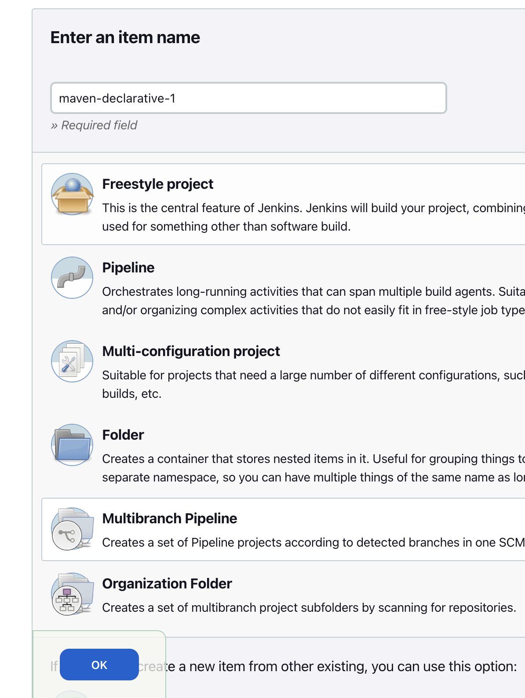
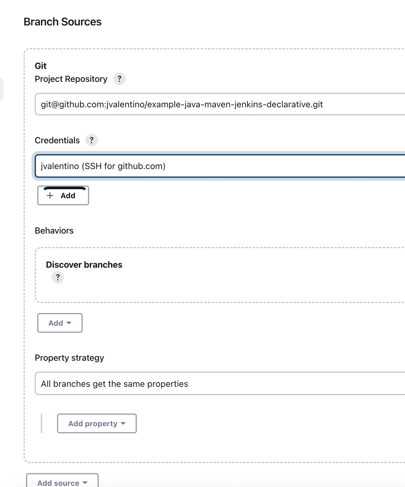
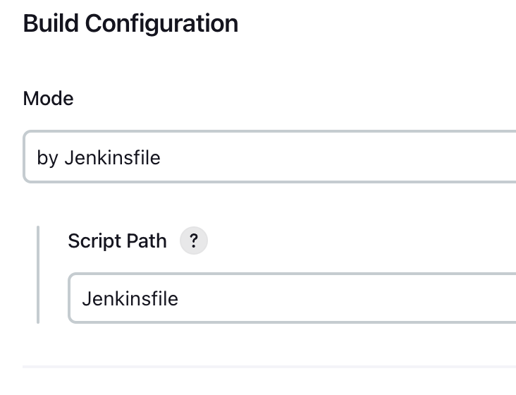
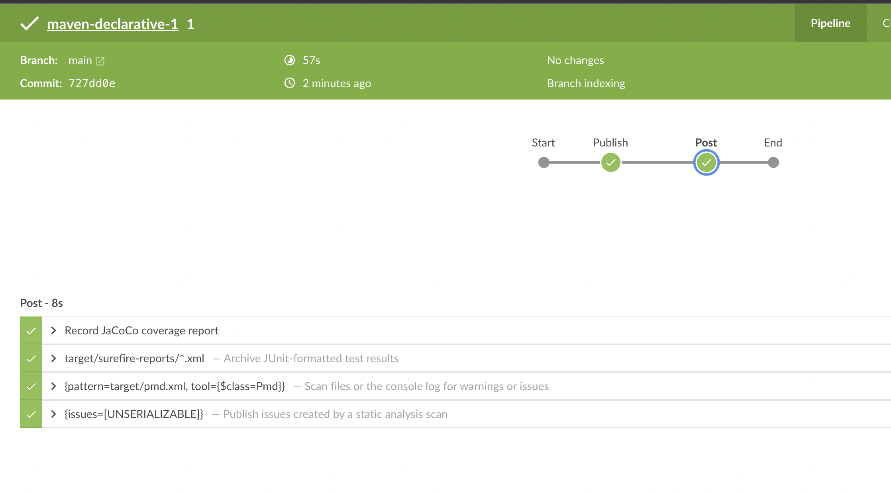
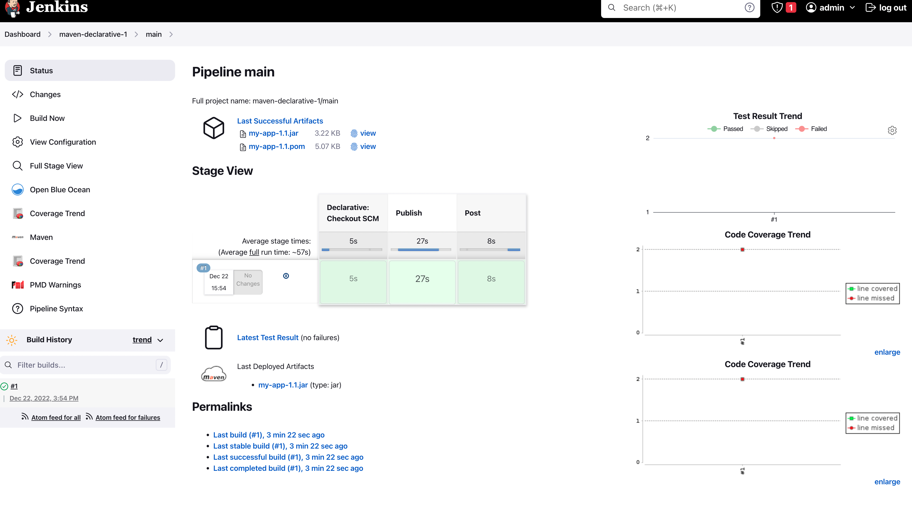

# Using a Declarative Pipeline to deliver Java Libraries with Maven

Prerequisites

- Git Setup: https://github.com/jvalentino/setup-git
- Having setup Docker and Docker Compose: https://github.com/jvalentino/setup-docker
- Local Jenkins: https://github.com/jvalentino/example-docker-jenkins
- Building Java 101: https://github.com/jvalentino/java-building-101
- Maven-Java Part 1: https://github.com/jvalentino/example-java-maven-lib-1
- Maven-Java Part 2: https://github.com/jvalentino/example-java-maven-lib-2
- Maven-Java Part 3: https://github.com/jvalentino/example-java-maven-lib-3
- Maven-Java Part 4: https://github.com/jvalentino/example-java-maven-lib-4
- Jenkins Freestyle: https://github.com/jvalentino/example-java-maven-jenkins-freestyle
- Jenkins Scripted: https://github.com/jvalentino/example-java-maven-jenkins-scripted

# (1) Pipeline as Code

```groovy
pipeline {
  agent any

  stages {
    
    stage('Publish') {
      steps {
        withCredentials([usernamePassword(
        credentialsId: 'github-publish-maven', 
        passwordVariable: 'MVN_PASSWORD', 
        usernameVariable: 'MVN_USERNAME')]) {

          withMaven(mavenSettingsFilePath: 'settings.xml') {
            sh """
              ./mvnw deploy \
                  -Drepo.id=github \
                  -Drepo.login=${MVN_USERNAME} \
                  -Drepo.pwd=${MVN_PASSWORD} \
                  -Drevision=1.${BUILD_NUMBER}
            """
          }  
        }
      }
    } // Publish

    stage('Post') {
      steps {
        script {
          jacoco()
          junit 'target/surefire-reports/*.xml'
          def pmd = scanForIssues tool: [$class: 'Pmd'], pattern: 'target/pmd.xml'
          publishIssues issues: [pmd]
        }
      }
    } // Post

  }
}
```

# (2) Setup







# (3) Runtime



